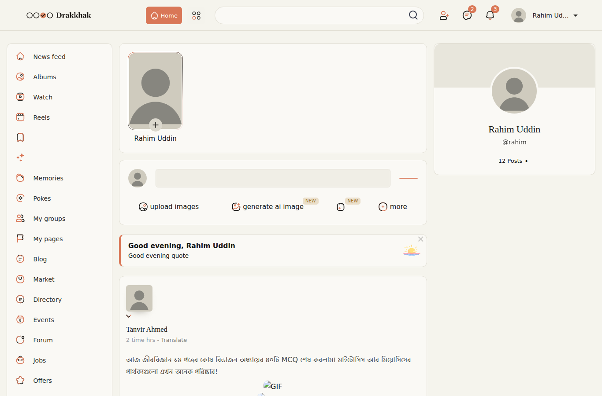
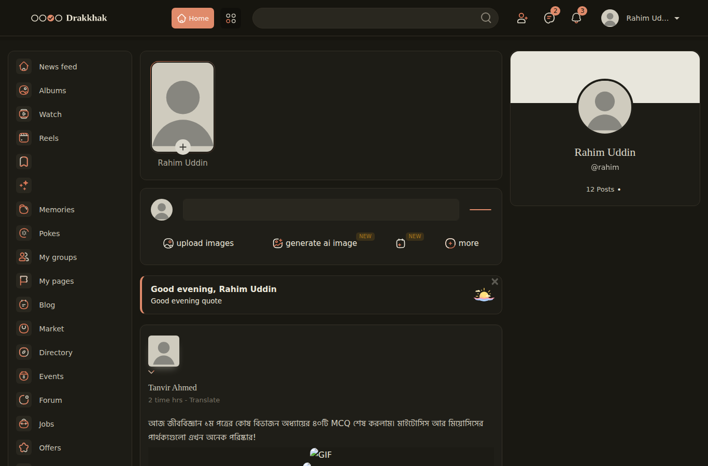
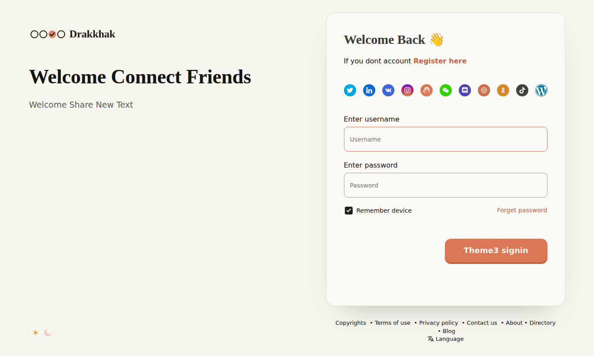
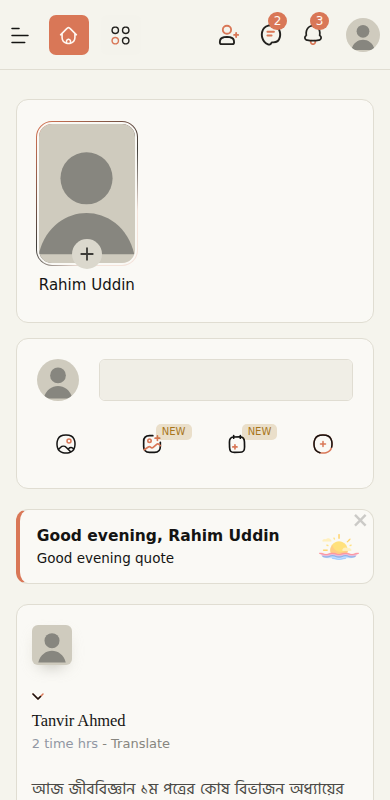

# Drakkhak — a WoWonder theme

The look of the Drakkhak practice site (`../iceskep`) for a WoWonder social network: warm
parchment by day, a lamp-lit desk by night, ink greys, one terracotta accent, serif headings,
Bangla-ready fonts served from the theme, and the four-bubble logo (the third bubble ticked).

| day | night | login | phone |
|---|---|---|---|
|  |  |  |  |

## Install

1. Upload the folder `theme/drakkhak` to your WoWonder site as `themes/drakkhak`
   (next to `themes/sunshine`).
2. Admin Panel → **Design → Themes** → activate **Drakkhak**.
3. Clear the browser cache once (WoWonder caches stylesheets by version).

The theme is built from the **Sunshine** theme you supplied, so it has every template that
version of WoWonder expects. Use it with the same WoWonder version as that Sunshine copy.

## Two themes: with or without the study site

| folder | name in the admin list | top bar |
|---|---|---|
| `theme/drakkhak` | Drakkhak | as Sunshine, in the Drakkhak look |
| `theme/drakkhak-study` | Drakkhak + Study | the same, plus an **অনুশীলন** button with the four-bubble mark beside Home, which opens the Drakkhak practice site |

To use **Drakkhak + Study** as one site:

1. Upload `theme/drakkhak-study` to WoWonder as `themes/drakkhak-study` and activate **Drakkhak + Study**.
2. Upload the practice site (everything in `iceskep/` except `source/`, `CLAUDE.md` and `.git`) into a
   folder named **`study`** in your WoWonder root, so it opens at `https://your-site/study/`.

That's all. The theme's button goes to `/study/`, and the practice site, seeing itself in `/study/`,
shows a **কমিউনিটি** button in its own top bar that leads back to the social network. To put the
practice site somewhere else, change `$dk_study_url` in `layout/header/content.phtml`. On the practice
site's side, set `communityUrl` in `js/config.js`.

The two keep separate records: WoWonder accounts live on the server, while practice progress stays in
each student's browser, as before.

## What is different from Sunshine

- **Colours.** Every colour in the stylesheets was moved onto the Drakkhak palette. Greys became
  parchment and ink, blues and purples became terracotta, greens became the "right" green, reds the
  "wrong" red, oranges the gold. `dark.css` became the warm night palette. Illustrations, emoji,
  reactions and brand icons (Google, Facebook…) keep their own colours.
- **Button and header colours are fixed by the theme.** To hand them back to Admin Panel →
  Design → Manage Colors, set `$drakkhak_palette = false;` at the top of `layout/style.phtml`.
- **Fonts.** Text is Hind Siliguri and headings, names and titles are Noto Serif Bengali, both
  loaded from `fonts/drakkhak/`. The Google Fonts request Sunshine made is gone, which is lighter
  on slow data.
- **Shapes.** Cards have one thin warm edge instead of floating shadows. The main buttons are the
  raised terracotta ones from the practice site. The header is parchment with a hairline rule.
- **Welcome and login.** Parchment background and a single card for the form.
- **Logo.** The four-bubble logo is in `img/logo.png` and `img/night-logo.png`. The favicon is one
  ticked bubble (`img/icon.png`, `img/favicon.svg`). The picture in the admin theme list is
  `themeLogo.png`. If you upload a logo in the admin panel, WoWonder replaces `img/logo.png`.

The theme's own stylesheet is `stylesheet/drakkhak.css`, plus `stylesheet/drakkhak-night.css` in
night mode. Both load after Sunshine's CSS; put small tweaks there.

## Rebuilding from a newer Sunshine

When WoWonder updates, take the new `themes/sunshine` folder and run:

```
python3 theme/build/build.py path/to/new/sunshine theme/drakkhak
python3 theme/build/build.py path/to/new/sunshine theme/drakkhak-study --study
```

`build/build.py` does every step above from scratch: it recolours, swaps the fonts, patches
`container.phtml` and `style.phtml`, and copies `build/overlay/` (logos, fonts, the two stylesheets,
`info.php`) on top. If a newer Sunshine changes the lines it patches, it stops and says which one.

## Honest limits

- I had no running WoWonder site. The previews above come from the real templates rendered with
  placeholder data, so things like the broken images in the post and "Good evening quote" are
  placeholders, not the theme. Check the live site after activating, especially pages not shown
  here (profile, groups, market, admin-facing pages).
- The recolour is automatic. A few spots may need a hand-tweak in `drakkhak.css`, for example a
  text colour that Sunshine's own night mode never set.
- Chat colours that users pick per conversation are left alone.
